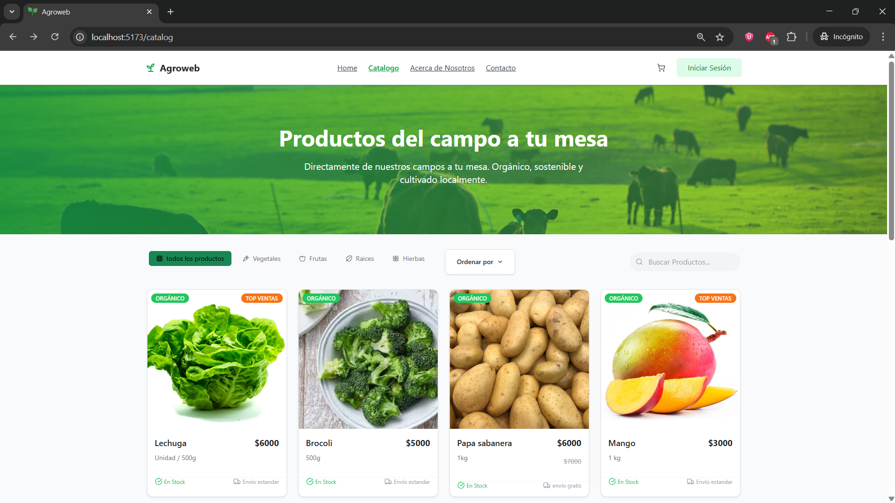
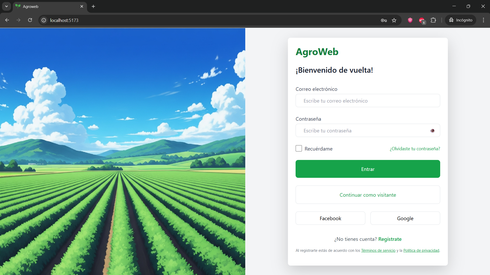

# 🌱 AgroWeb FrontEnd

Este es el frontend de AgroWeb, una plataforma para la gestión y visualización de productos del agro colombiano. Desarrollado con **React**, **TypeScript** y **Vite**, este frontend consume los servicios REST del backend para mostrar un catálogo dinámico de productos, gestionar autenticación de usuarios y permitir el registro de nuevos usuarios.

---

## 🚀 Tecnologías Utilizadas

- [React](https://react.dev/) + [TypeScript](https://www.typescriptlang.org/)
- [Vite](https://vitejs.dev/) para desarrollo y build rápido
- [Tailwind CSS](https://tailwindcss.com/) para estilos utilitarios
- [React Router](https://reactrouter.com/) para navegación SPA
- [@heroui/react](https://heroui.dev/) y [Iconify](https://iconify.design/) para UI y componentes visuales
- [Bootstrap](https://getbootstrap.com/) (en formularios de registro)
- [bcryptjs](https://github.com/dcodeIO/bcrypt.js) para hashing de contraseñas en el registro

---

## 📦 Estructura del Proyecto

```
FrontEnd/
├── public/
│   └── vite.svg
├── src/
│   ├── assets/            # Imágenes y recursos estáticos
│   ├── components/        # Componentes React (catálogo, login, registro, etc.)
│   ├── data/              # Funciones para consumir la API de productos
│   ├── types/             # Tipos TypeScript (ej: Product)
│   ├── App.tsx            # Definición de rutas principales
│   ├── main.tsx           # Entry point de la app
│   └── index.css          # Tailwind y estilos globales
├── tailwind.config.js
├── package.json
└── ...
```

---

## ✨ Funcionalidades Principales

- **Catálogo de productos:**  
  Visualiza productos en tiempo real, filtrados por categoría, búsqueda y ordenados por precio o nombre.  
  Las imágenes y datos se obtienen dinámicamente del backend.

- **Autenticación de usuarios:**  
  Login seguro con recuperación del nombre de usuario para mostrarlo en la interfaz si el usuario está autenticado.

- **Registro de usuarios:**  
  Formulario completo con validaciones y hash de contraseña antes de enviar al backend.

- **Navegación SPA:**  
  Navegación fluida entre catálogo, login y registro sin recargar la página.

- **Responsive y moderno:**  
  Interfaz adaptable a dispositivos móviles y escritorio, con diseño limpio y profesional.

---

## 🔗 Integración con Backend

- El frontend consume el microservicio de productos (`/products`) y de usuarios (`/users`) vía REST API.
- El catálogo se actualiza automáticamente con los productos registrados en el backend.
- El login y registro interactúan con el microservicio de usuarios para autenticación y creación de cuentas.

---

## 🛠️ Instalación y Ejecución

1. Instala las dependencias:
   ```bash
   npm install
   ```
2. Ejecuta el frontend en modo desarrollo:
   ```bash
   npm run dev
   ```
3. Accede a la app en [http://localhost:5173](http://localhost:5173) (por defecto).

> **Nota:**  
> Si cambias los puertos o el dominio de los microservicios backend, recuerda actualizar el archivo `.env` antes de iniciar el frontend.

---

## 🖼️ Capturas de Pantalla

### Catálogo de Productos


### Pantalla de Login


---

## 🔧 Configuración de la API

Las URLs de los microservicios backend se configuran en el archivo `.env` en la raíz del frontend.  
Por defecto, el archivo `.env` incluye:

```env
VITE_API_PRODUCTS_URL=http://localhost:5000 VITE_API_USERS_URL=http://localhost:5001
```


Si necesitas cambiar la URL o el puerto (por ejemplo, para producción o pruebas), **solo modifica estos valores en el `.env`** y reinicia el servidor de desarrollo (`npm run dev`).  
No es necesario cambiar rutas directamente en el código fuente.

> El frontend accede a estas variables usando `import.meta.env.VITE_API_PRODUCTS_URL` y `import.meta.env.VITE_API_USERS_URL`.

---

## 📝 Notas

- Las imágenes de productos deben ser URLs absolutas o base64 válidas para mostrarse correctamente.
- El estado de autenticación se gestiona con `localStorage` (se almacena el nombre de usuario tras login).
- El frontend está preparado para ser extendido con nuevas vistas, funcionalidades y mejoras visuales.
- El campo imageUrl de cada producto debe ser una URL absoluta servida por el backend (ejemplo: http://localhost:5000/static/catalog/lechuga.avif).

---

## Historial de Cambios

[Ver historial de cambios (CHANGELOG.md)](CHANGELOG.md)

---

## 📄 Licencia

Este proyecto es parte de AgroWeb y se distribuye solo con fines académicos.

---